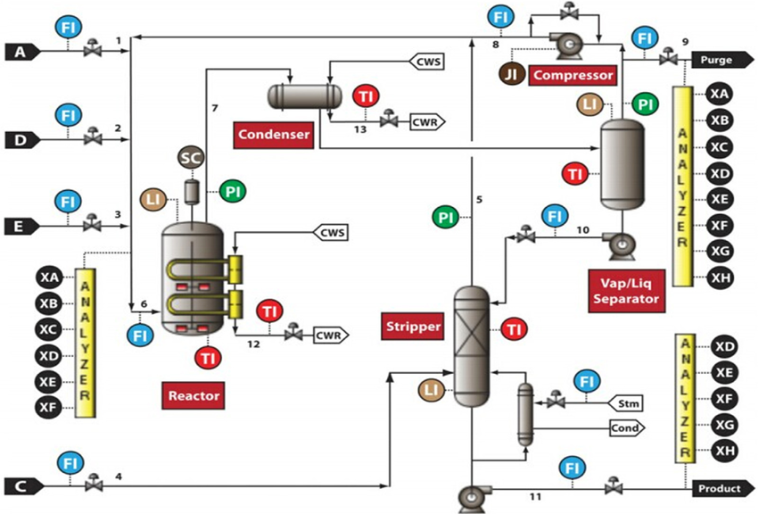

# Predicting product quality for Tennesee Eastman process

The TEP was created by the Eastman Chemical Company to provide a realistic industrial process for evaluating process control and monitoring methods. The test process is based on a simulation of an actual industrial process. The process consists of five major units: a reactor, condenser, compressor, separator, and stripper. The components A,C,D,E,F,B are the input for the process. G and H are the final product while F is the by-product.

The use of  intelligent data analysis tools to estimate key variables in the complex chemical processes is an important activity. It is sometimes essential to accurately predict the difficult-to-measure variables, especially quality as it has a direct impact on the economic operation of the plant.

## Process Variables
There are 41 measured variables and 12 manipulated variables in the process. Among those 41 measures variables 22 are sampled every 3 minutes, XMEAS(l) through XMEAS (22). The rest 19 are composition variables. These composition measurements, XMEAS (23) through XMEAS (41), are taken from Streams 6, 9, and 11. The sampling interval and time delay for Streams 6 and 9 are both equal to 6 minutes, and for Stream 11 are equal to 15 minutes. All the process measurements include Gaussian noise.

## Organization of Dataset
In the dataset there are 44 files. The files with name "*_te" are for testing. Files named as “d00” and “d00_te” are for normal operating conditions. Remaining are the data sets for faulty conditions for training and testing. Each training data file contains 480 rows and 52 columns. Each testing set contains 960 rows and 52 columns. The files with faults also have some data points for normal operation.

The dataset can be download from https://ieee-dataport.org/documents/tennessee-eastman-simulation-dataset#files

## Algorithm 
Support Vector Regression (TE_SVR.ipynb) and Neural Networks (TE_NN.ipynb) is used to estimate the quality of products G and H.
